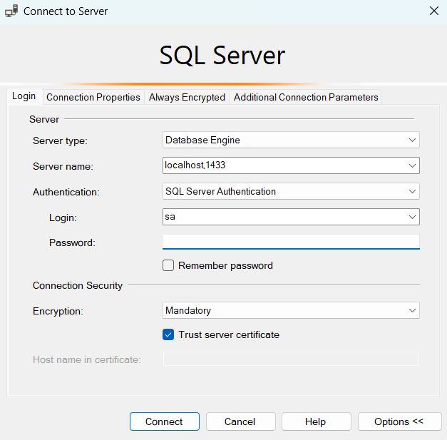
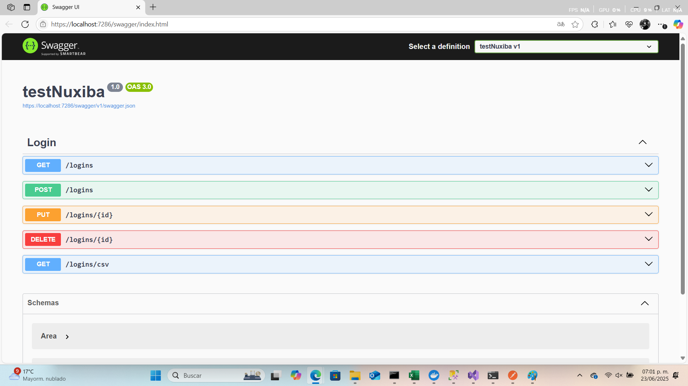
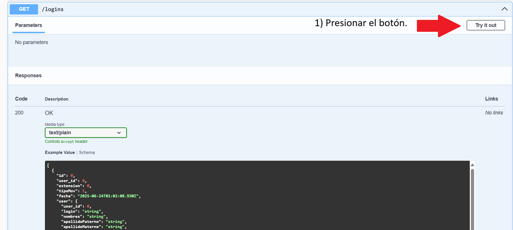
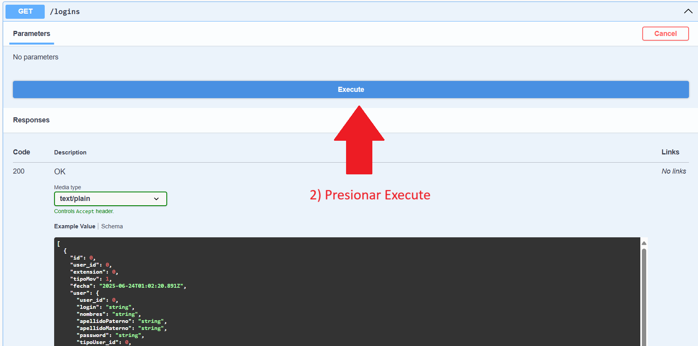
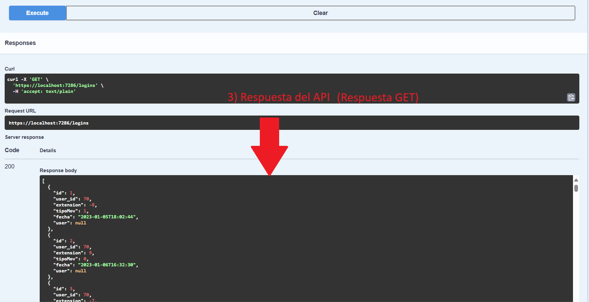
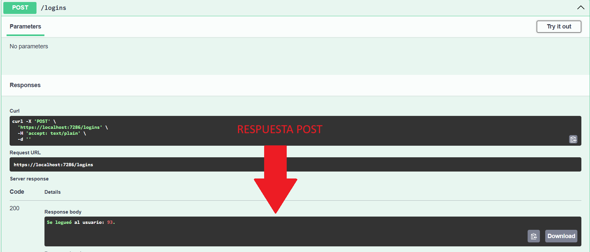
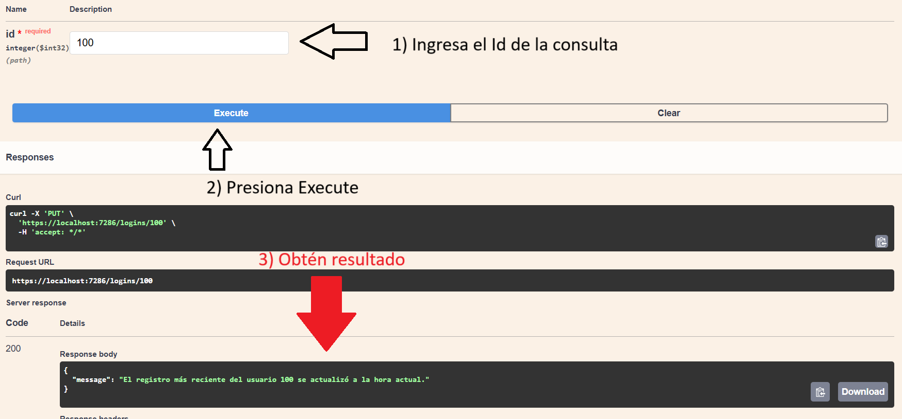
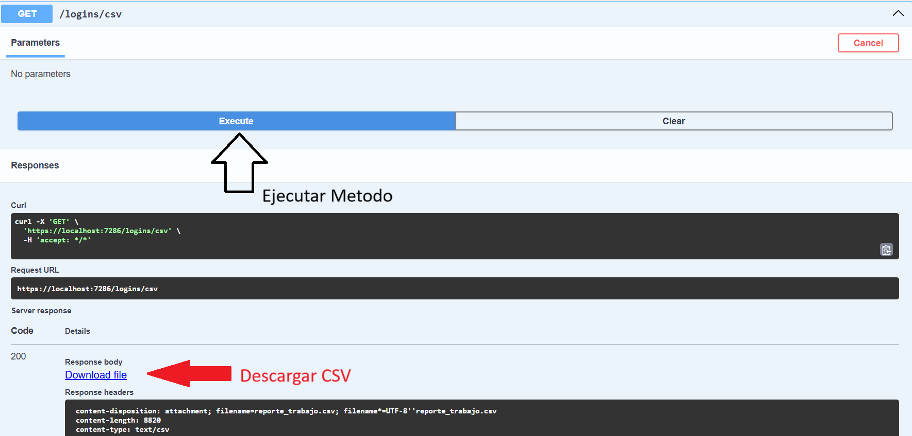

# EVALUACIÓN TÉCNICA NUXIBA

Prueba: **DESARROLLADOR JR**

Deadline: **1 día**

Nombre: **Uriel Giovanni Martinez Vivaldo**

---

## Clona y crea tu repositorio para la evaluación

1. Clona este repositorio en tu máquina local.
    ```bash
    git clone https://bitbucket.org/nuxibatechnologies/testdevbackjr.git
    ```
2. Crea un repositorio público en tu cuenta personal de GitHub, BitBucket o Gitlab.
    ```bash
    https://github.com/GiovanniVivaldo/testNuxiba
    ```
3. Cambia el origen remoto para que apunte al repositorio público que acabas de crear en tu cuenta.
    ```bash
    git remote remove origin
    git remote add origin https://github.com/GiovanniVivaldo/testNuxiba
    ```
4. Coloca tu nombre en este archivo README.md y realiza un push al repositorio remoto.

---

## Instrucciones Generales

1. Cada pregunta tiene un valor asignado. Asegúrate de explicar tus respuestas y mostrar las consultas o procedimientos que utilizaste.
2. Se evaluará la claridad de las explicaciones, el pensamiento crítico, y la eficiencia de las consultas.
3. Utiliza **SQL Server** para realizar todas las pruebas y asegúrate de que las consultas funcionen correctamente antes de entregar.
4. Justifica tu enfoque cuando encuentres una pregunta sin una única respuesta correcta.
5. Configura un Contenedor de **SQL Server con Docker** utilizando los siguientes pasos:

### Pasos para ejecutar el contenedor de SQL Server

Asegúrate de tener Docker instalado y corriendo en tu máquina. Luego, ejecuta el siguiente comando para levantar un contenedor con SQL Server:

```bash
docker run -e 'ACCEPT_EULA=Y' -e 'SA_PASSWORD=YourStrong!Passw0rd'    -p 1433:1433 --name sqlserver -d mcr.microsoft.com/mssql/server:2019-latest
```

6. Conéctate al servidor de SQL con cualquier herramienta como **SQL Server Management Studio** o **Azure Data Studio** utilizando las siguientes credenciales:
   - **Servidor**: localhost, puerto 1433
   - **Usuario**: sa
   - **Contraseña**: YourStrong!Passw0rd

---

# Examen Práctico para Desarrollador Junior en .NET 8 y SQL Server

**Tiempo estimado:** 1 día  
**Total de puntos:** 100

---

## Instrucciones Generales:

El examen está compuesto por tres ejercicios prácticos. Sigue las indicaciones en cada uno y asegúrate de entregar el código limpio y funcional.

Además, se proporciona un archivo **CCenterRIA.xlsx** para que te bases en la estructura de las tablas y datos proporcionados.

[Descargar archivo de ejemplo](CCenterRIA.xlsx)

---

## Ejercicio 1: API RESTful con ASP.NET Core y Entity Framework (40 puntos)

**Instrucciones:**  
Desarrolla una API RESTful con ASP.NET Core y Entity Framework que permita gestionar el acceso de usuarios.

1. **Creación de endpoints**:
   - **GET /logins**: Devuelve todos los registros de logins y logouts de la tabla `ccloglogin`. (5 puntos)
   - **POST /logins**: Permite registrar un nuevo login/logout. (5 puntos)
   - **PUT /logins/{id}**: Permite actualizar un registro de login/logout. (5 puntos)
   - **DELETE /logins/{id}**: Elimina un registro de login/logout. (5 puntos)
   
Para desarrollar este API RESTful utilizando Entity Framework Core, se instalaron las siguientes bibliotecas esenciales:
**EntityFrameworkCore.SqlServer** 
**EntityFrameworkCore.Tools** 
**EntityFrameworkCore.Design**

Se organizaron los archivos en carpetas clave para mantener una estructura limpia y modular:

**Data**: Contiene la clase dbContext, responsable de la conexión y el mapeo con la base de datos.
**Models**: Define las clases que representan las tablas de la base de datos.
**Controllers**: Donde se encuentran los endpoints de la API.

La clase dbContext mapea las tablas de la base de datos con objetos en C# mediante DbSet. Está ubicada dentro de la carpeta Data.
```bash
using Microsoft.EntityFrameworkCore;
using testNuxiba.Models;

namespace testNuxiba.Data
{
    public class dbContext : DbContext
    {
        public dbContext(DbContextOptions<dbContext> options) : base(options) { }

        // Tabla: ccUsers
        public DbSet<User> ccUsers { get; set; }
        // Tabla: ccLogLogin
        public DbSet<Login> ccLogLogin { get; set; }
        // Tabla: ccRIACat_Areas
        public DbSet<Area> ccRIACat_Areas { get; set; }
    }
}
```
Dentro del archivo **appsettings.json** se debe hacer la cadena de conexion a la base de datos de la siguiente manera: 
```bash
{
    "ConnectionStrings": {
   "Conexion": "Server=localhost,1433;Database=TestNuxibaDB;User Id=sa;Password=YourStrong!Passw0rd; TrustServerCertificate=True;"
 }
 //resto del codigo default...
}
```
en el archivo **Program.cs** se debe registrar el context creado para que la aplicacion sepa sobre la base de datos, se debe declarar este registro antes de la instruccion **var app = builder.Build();**
```bash
builder.Services.AddDbContext<dbContext>(Options => Options.UseSqlServer(builder.Configuration.GetConnectionString("Conexion")));
```

para la creacion de los enpoints se debe crear una clase controller, la cual en este caso se llamo **loginController** y aqui se guardaron cada uno de los endpoints
  - **GET /logins**:
  este codigo devuelve todos los registros dentro de la tabla ccLogLogin, es una instruccion simple de **EF CORE**
```bash
        [HttpGet]
        public async Task<ActionResult<IEnumerable<Login>>> GetLogins()
        {
            return await _context.ccLogLogin.ToListAsync();
        }
```
  - **POST /logins**:
Este código verifica si existe algún usuario que haya iniciado sesión (login) y aún no haya cerrado sesión (logout). Si encuentra un caso así, registra automáticamente un logout para ese usuario. En caso contrario, selecciona un usuario aleatorio de la base de datos y registra un nuevo login, igualmente si la base de datos esta vacia valida que no se puede realizar alguna opcion.
```bash
[HttpPost]
public async Task<ActionResult<string>> ToggleLogin()
{
    var now = DateTime.Now;

    //Buscar al último usuario que esté logueado (último movimiento = login sin logout)
    var lastLogin = await _context.ccLogLogin
        .OrderByDescending(l => l.Fecha)
        .FirstOrDefaultAsync();

    if (lastLogin != null && lastLogin.TipoMov == 1)
    {
        // El último movimiento fue un login entonces se desloguea
        var logout = new Login
        {
            User_id = lastLogin.User_id,
            TipoMov = 0,
            Fecha = now,
            Extension = lastLogin.Extension
        };

        _context.ccLogLogin.Add(logout);
        await _context.SaveChangesAsync();

        return Ok($"Se deslogueó al usuario con ID {logout.User_id}.");
    }
    else
    {
        // No hay login activo -> loguear a un usuario aleatorio
        var user = await _context.ccUsers.OrderBy(u => Guid.NewGuid()).FirstOrDefaultAsync();
        if (user == null)
            return NotFound("No hay usuarios disponibles para loguear.");

        var login = new Login
        {
            User_id = user.User_id,
            TipoMov = 1,
            Fecha = now,
            Extension = new Random().Next(-10, 11)
        };

        _context.ccLogLogin.Add(login);
        await _context.SaveChangesAsync();

        return Ok($"Se logueó al usuario: {user.User_id}.");
    }
}
```
  - **PUT /logins/{id}**:
Esta función recibe el ID de un usuario y verifica si existen registros asociados en la tabla. Si los hay, actualiza la fecha del registro más reciente (ya sea login o logout) a la hora actual.
```bash
[HttpPut("{id}")]
        public async Task<IActionResult> PutLogin(int id)
        {
            // Busca el registro más reciente por User_id (id = User_id aquí)
            var existing = await _context.ccLogLogin
                .Where(l => l.User_id == id)
                .OrderByDescending(l => l.Fecha)
                .FirstOrDefaultAsync();

            if (existing == null)
            {
                return NotFound($"No se encontró un login/deslogin para el usuario con ID {id}.");
            }

            // Actualiza la fecha a la actual
            existing.Fecha = DateTime.Now;

            await _context.SaveChangesAsync();

            return Ok(new
            {
                Message = $"El registro más reciente del usuario {id} se actualizó a la hora actual.",
            });
        }
```
  - **DELETE /logins/{id}**:
Este método utiliza el ID de un registro en la tabla ccLogLogin para verificar su existencia. Si el registro existe, procede a eliminarlo de la base de datos.
```bash
        [HttpDelete("{id}")]
        public async Task<IActionResult> DeleteLogin(int id)
        {
            var login = await _context.ccLogLogin.FindAsync(id);
            if (login == null)
            {
                return NotFound("Registro no encontrado.");
            }

            _context.ccLogLogin.Remove(login);
            await _context.SaveChangesAsync();

            return Ok(new
            {
                Message = $"Registro eliminado.",
            });
        }
```
2. **Modelo de la entidad**:  
   Crea el modelo `Login` basado en los datos de la tabla `ccloglogin`:
   - `User_id` (int)
   - `Extension` (int)
   - `TipoMov` (int) → 1 es login, 0 es logout
   - `fecha` (datetime)
 Para realizar el modelo se tomo en cuenta los datos proporcionados por la tabla y se realizo el siguiente modelo:
```bash
using System;
using System.ComponentModel.DataAnnotations;
using System.ComponentModel.DataAnnotations.Schema;

namespace testNuxiba.Models
{
    [Table("ccLogLogin")]
    public class Login
    {
        //se agrega ID ya que es necesario tener un ID unico en EF
        [Key]
        public int Id { get; set; }

        [Required]
        public int User_id { get; set; }
        
        public int? Extension {  get; set; }
        
        [Required]
        [Range(0,1)]
        public int TipoMov {  get; set; }

        [Required]
        public DateTime Fecha { get; set; }
        
        [ForeignKey("User_id")]
        public User? User { get; set; }

    }
}
```
3. **Base de datos**:  
   Utiliza **Entity Framework Core** para crear la tabla en una base de datos SQL Server basada en este modelo. Aplica migraciones para crear la tabla en la base de datos. (10 puntos)
 
Para realizar esta actividad se utilizo la consola de **NuGet** y se realizaron los siguientes comandos:
```bash
Add-Migration InicialCrearLogin
```
El comando anterior sirve para crear la carpeta de migrations que contiene los cambios que se aplicaran a la base de datos

despues de esto se tiene que utilizar el comando
```bash
Update-Database
```
el cual realizara los cambios en la base de datos, en este caso la creacion de la tabla
4. **Validaciones**:  
   Implementa las validaciones necesarias para asegurar que las fechas sean válidas y que el `User_id` esté presente en la tabla `ccUsers`. Además, maneja errores como intentar registrar un login sin un logout anterior. (10 puntos)

Las validaciones fueron presentadas en la parte de los endpoints, en el caso de las validaciones de tiempo, no fueron necesarias ya que se toma siempre el tiempo del sistema.

5. **Pruebas Unitarias** (Opcional):  
   Se valorará si incluyes pruebas unitarias para los endpoints de tu API utilizando un framework como **xUnit** o **NUnit**. (Puntos extra)

No se realizo ya que fue probado con **Swagger** el cual permite realizar pruebas mas visuales y igual da reporte de errores.

---


## Ejercicio 2: Consultas SQL y Optimización (30 puntos)

**Instrucciones:**

Trabaja en SQL Server y realiza las siguientes consultas basadas en la tabla `ccloglogin`:

1. **Consulta del usuario que más tiempo ha estado logueado** (10 puntos):
   - Escribe una consulta que devuelva el usuario que ha pasado más tiempo logueado. Para calcular el tiempo de logueo, empareja cada "login" (TipoMov = 1) con su correspondiente "logout" (TipoMov = 0) y suma el tiempo total por usuario.

   Ejemplo de respuesta:  
   - `User_id`: 92  
   - Tiempo total: 361 días, 12 horas, 51 minutos, 8 segundos

Para esta consulta fueron tomados en cuenta los registros de entrada y de salida de los usuarios, para tomar la diferencia en tiempo entre la entrada y la salida, se valida que sea del mismo usuario, posteriormente que la fecha de la entrada sea menor a la de la salida, posteriormente se desacartan registros que solo tienen registrado el login y se hace un **SUM** con un **GROUP BY** para tener los tiempos de cada usario, se utiliza **SELECT TOP 1**, **ORDER BY** Y **DESC** para mostrar el usuario que mas tiempo se conecto y para el tiempo se realizaron converisones manuales apartir de los segundos que se contaron.
```bash
WITH Sesiones AS (
    SELECT 
        l.User_id,
        l.Fecha AS FechaLogin,
        o.Fecha AS FechaLogout,
        DATEDIFF(SECOND, l.Fecha, o.Fecha) AS DuracionSegundos
    FROM ccLogLogin l

    -- Emparejamos cada login con su primer logout posterior (del mismo usuario)
    OUTER APPLY (
        SELECT TOP 1 o.*
        FROM ccLogLogin o
        WHERE o.User_id = l.User_id         -- mismo usuario
          AND o.TipoMov = 0                 -- logout
          AND o.Fecha > l.Fecha             -- posterior
        ORDER BY o.Fecha
    ) o

    WHERE l.TipoMov = 1                     -- solo logins
      AND o.Fecha IS NOT NULL              -- asegurar que tenga logout
),
Totales AS (
    SELECT 
        User_id,
        SUM(DuracionSegundos) AS TotalSegundos
    FROM Sesiones
    GROUP BY User_id
)
SELECT TOP 1
    User_id,
    FORMAT(TotalSegundos / 86400, '0') + ' días, ' +
    FORMAT((TotalSegundos % 86400) / 3600, '00') + ' horas, ' +
    FORMAT((TotalSegundos % 3600) / 60, '00') + ' minutos, ' +
    FORMAT(TotalSegundos % 60, '00') + ' segundos' AS TiempoTotal
FROM Totales
ORDER BY TotalSegundos DESC;
```

dando como resultado

el User_Id: **92** se conecto durante 	**361 días, 12 horas, 51 minutos, 08 segundos**
2. **Consulta del usuario que menos tiempo ha estado logueado** (10 puntos):
   - Escribe una consulta similar a la anterior, pero que devuelva el usuario que ha pasado menos tiempo logueado.

   Ejemplo de respuesta:  
   - `User_id`: 90  
   - Tiempo total: 244 días, 43 minutos, 15 segundos
   - 
para este ejercicio se utilizo el mismo que el anterior pero en el ordenamiento se utilizo **ASC**
dando como resultado:
el usuario **90** se conecto unicamente **244 días, 00 horas, 43 minutos, 15 segundos**
3. **Promedio de logueo por mes** (10 puntos):
   - Escribe una consulta que calcule el tiempo promedio de logueo por usuario en cada mes.

   Ejemplo de respuesta:  
   - Usuario 70 en enero 2023: 3 días, 14 horas, 1 minuto, 16 segundos

para este ejercicio se tomo como base los dos anteriores pero aqui en vez de hacer un SUM se realizo la funcion **AVG** para realizar el promedio quedando la siguiente consulta:
```bash
WITH Sesiones AS (
    SELECT 
        l.User_id,
        l.Fecha AS FechaLogin,
        o.Fecha AS FechaLogout,
        DATEDIFF(SECOND, l.Fecha, o.Fecha) AS DuracionSegundos
    FROM ccLogLogin l

    -- Emparejamos cada login con su primer logout posterior del MISMO usuario
    OUTER APPLY (
        SELECT TOP 1 o.*
        FROM ccLogLogin o
        WHERE o.User_id = l.User_id           -- mismo usuario
          AND o.TipoMov = 0                   -- logout
          AND o.Fecha > l.Fecha               -- posterior al login
        ORDER BY o.Fecha
    ) o

    WHERE l.TipoMov = 1                       -- solo registros de login
      AND o.Fecha IS NOT NULL                 -- aseguramos que hubo logout
),
PromedioPorMes AS (
    SELECT 
        User_id,
        FORMAT(FechaLogin, 'yyyy-MM') AS Mes,
        AVG(DuracionSegundos) AS PromedioSegundos
    FROM Sesiones
    GROUP BY User_id, FORMAT(FechaLogin, 'yyyy-MM')
)
SELECT 
    User_id,
    Mes,
    FORMAT(PromedioSegundos / 86400, '0') + ' días, ' +
    FORMAT((PromedioSegundos % 86400) / 3600, '00') + ' horas, ' +
    FORMAT((PromedioSegundos % 3600) / 60, '00') + ' minutos, ' +
    FORMAT(PromedioSegundos % 60, '00') + ' segundos' AS PromedioLogueo
FROM PromedioPorMes
ORDER BY User_id, Mes;
```

---

## Ejercicio 3: API RESTful para generación de CSV (30 puntos)

**Instrucciones:**

1. **Generación de CSV**:  
   Crea un endpoint adicional en tu API que permita generar un archivo CSV con los siguientes datos:
   - Nombre de usuario (`Login` de la tabla `ccUsers`)
   - Nombre completo (combinación de `Nombres`, `ApellidoPaterno`, y `ApellidoMaterno` de la tabla `ccUsers`)
   - Área (tomado de la tabla `ccRIACat_Areas`)
   - Total de horas trabajadas (basado en los registros de login y logout de la tabla `ccloglogin`)

   El CSV debe calcular el total de horas trabajadas por usuario sumando el tiempo entre logins y logouts.

2. **Formato y Entrega**:
   - El CSV debe ser descargable a través del endpoint de la API.
   - Asegúrate de probar este endpoint utilizando herramientas como **Postman** o **curl** y documenta los pasos en el archivo README.md.

Para la realizacion del endpoint se tomaron como base los models de las otras dos tablas de la base de datos, posteriormente se realizaron consultas similares a las de SQL pero con **EF** y con estas consultas se genera un **CSV** en la memoria de la aplicacion para despues poder descargarlo.
```bash
[HttpGet("csv")]
public async Task<IActionResult> GetCsvReport()
{
    // Obtener todos los movimientos ordenados
    var movimientos = await _context.ccLogLogin
        .OrderBy(m => m.User_id)
        .ThenBy(m => m.Fecha)
        .ToListAsync();

    var sesiones = new List<(int UserId, TimeSpan Duracion)>();

    // Emparejar login con logout por usuario
    foreach (var grupo in movimientos.GroupBy(m => m.User_id))
    {
        var lista = grupo.ToList();
        for (int i = 0; i < lista.Count - 1; i++)
        {
            if (lista[i].TipoMov == 1) // login
            {
                var logout = lista.Skip(i + 1).FirstOrDefault(x => x.TipoMov == 0 && x.Fecha > lista[i].Fecha);
                if (logout != null)
                {
                    sesiones.Add((lista[i].User_id, logout.Fecha - lista[i].Fecha));
                    i = lista.IndexOf(logout); // saltar al logout
                }
            }
        }
    }

    // Agrupar y sumar duración por usuario
    var resumen = sesiones
        .GroupBy(s => s.UserId)
        .Select(g => new
        {
            UserId = g.Key,
            TotalHoras = g.Sum(x => x.Duracion.TotalHours)
        })
        .ToList();

    // Obtener info de usuarios + área
    var datosFinales = await _context.ccUsers
        .Include(u => u.Area)
        .Select(u => new
        {
            u.User_id,
            u.Login,
            NombreCompleto = u.Nombres + " " + u.ApellidoPaterno + " " + u.ApellidoMaterno,
            Area = u.Area != null ? u.Area.AreaName : "",
        })
        .ToListAsync();

    // Generar CSV en memoria
    var csv = new StringBuilder();
    csv.AppendLine("Login,Nombre Completo,Area,TotalHoras");

    foreach (var usuario in datosFinales)
    {
        var total = resumen.FirstOrDefault(x => x.UserId == usuario.User_id)?.TotalHoras ?? 0;
        csv.AppendLine($"{usuario.Login},{usuario.NombreCompleto},{usuario.Area},{total:F2}");
    }

    var bytes = Encoding.UTF8.GetBytes(csv.ToString());
    return File(bytes, "text/csv", "reporte_trabajo.csv");
}
```
---


## Entrega

1. Sube tu código a un repositorio en GitHub o Bitbucket y proporciona el enlace para revisión.
2. El repositorio debe contener las instrucciones necesarias en el archivo **README.md** para:
   - Levantar el contenedor de SQL Server.
para levantar el contenedor de SQL Server se realiza la instalacion con el comando:
```bash
docker run -e "ACCEPT_EULA=Y" -e "SA_PASSWORD=YourStrong!Passw0rd" -p 1433:1433 --name sqlserver -d mcr.microsoft.com/mssql/server:2019-latest
```

posteriormente puedes verificar el estatus del contenedor y levantarlo si es necesario con los comandos:
```bash
docker ps
docker start sqlserver
```

   - Conectar la base de datos.
para conectarse a la base de datos desde **SSMS** se tiene que poner lo siguiente en la pantalla de conexion:


   - Ejecutar la API y sus endpoints.
para la ejecucion de la API se hace con **SWAGGER** y **https** en el navegador se muestra la siguiente pantalla:


posteriormente se selecciona alguna accion y se realiza lo siguiente:




y las respuestas de los metodos son las siguientes:







   - Descargar el CSV generado.



3. **Opcional**: Si incluiste pruebas unitarias, indica en el README cómo ejecutarlas.

---

Este examen evalúa tu capacidad para desarrollar APIs RESTful, realizar consultas avanzadas en SQL Server y generar reportes en formato CSV. Se valorará la organización del código, las mejores prácticas y cualquier documentación adicional que proporciones.
